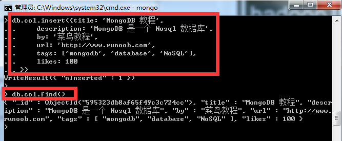
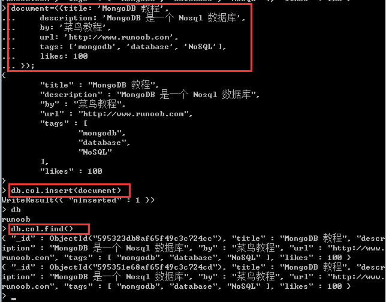
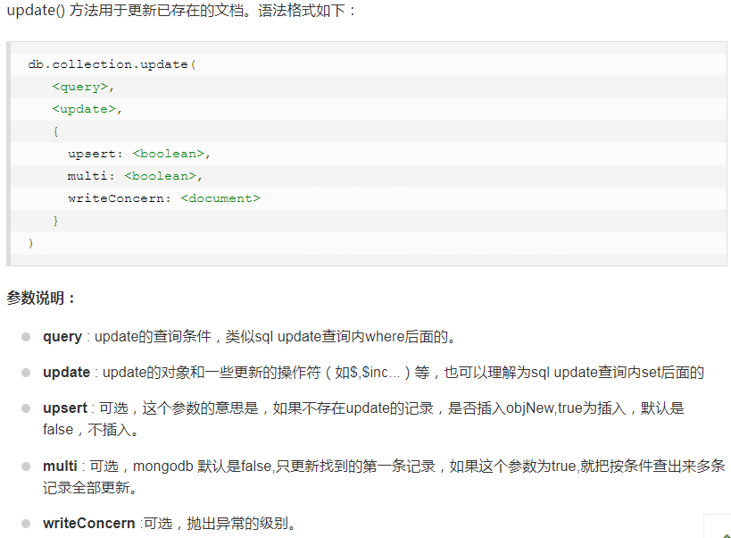

# 启动

在bin文件夹下的终端执行mongod

在另一个同文件夹下的终端执行mongo,以启动mongodb shell,之后在这里执行后续程序

# 概念

**集合**：类似于关系数据库中的表。它是mongdb中的一组文档

**文档**：类似于关系数据库中的行。它是mongdb中的基本单元，唯一标识"_id"数据库可自动生成

**数据库**

**Mongodb Shell**:自带的JS Shell，JS解释器。运行mongo启动shell后自动连接Mongodb服务器，运行javascript程序。可以再shell窗口里面进行javascript函数的一些操作。
        
shell也是Mongodb客户端，shell连接Mongodb服务器的test数据库，并将该数据库的连接赋值给全局变量db，即shell访问mongodb数据库的主要入口点。

### show dbs

显示所有数据的列表

### db

显示当前数据库对象或集合

### use

连接到一个指定的数据库

### use DATABASE_NAME  （如use runoob）

创建一个数据库，此时执行"show dbs"显示的数据库列表中没有它，需要为它插入一些数据之后，该数据库才会出现在"show dbs"的列表中

#### 插入数据

db.runoob.insert({"name":"菜鸟教程"})

### db.dropDatabase()

删除当前数据库

### 删除集合

db.collection.drop()  &nbsp;&nbsp;&nbsp;&nbsp;&nbsp;&nbsp;&nbsp; 其中，collection是集合名字

	
### 向集合中插入文档

db.COLLECTION_NAME.insert(document)

### 查看已插入该集合中的文档：

db.COLLECTION_NAME.find()

上面两项的实例（其中col为当前数据库runoob的集合名）：

C

### 将文档定义为变量，通过变量将该文档插入到集合，并查看该集合

### 更新文档

例如：（其中col是集合的名字,寻找titile为‘MongoDB教程’的第一个文档，替换成‘MongoDB’）
>  db.col.update({'title':'MongoDB 教程'},{$set:{'title':'MongoDB'}})

